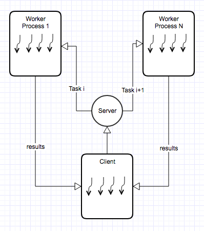
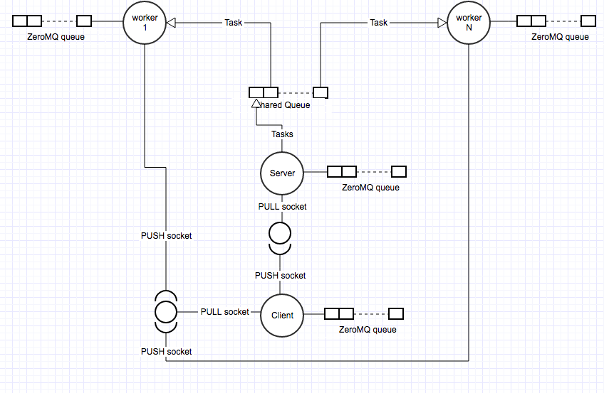

=================================================================
``All-in-memory asynchronous multiprocessing`` client-server COM
=================================================================

The following caveats are important:

1.  The requirements are vague so there are many lose ends that would require further understanding to design the
    one architecture or another. I guess this is the whole purpose of the exercise.
2.  I assume that no persistency is required so logging and in-disk databases have been avoided.
3.  No specific instructions are provided about how both the client and server know of each other. This is another
    whole layer of complexity so I assume they know where each other are. This will be explained later on.
4.  I supposed that both processes need to be able to talk to each other whether they are local or remote so the
    solution has been coded deal with that - whether this is over TCP or IPC.
5.  Although no such thing is described on the document, it seems obvious that the server work station should be
    multi-core machine given the natural needs that one can infer from the description of the problem
6.  Security implications are not taken into account either. I assume for the purpose of the exercise that the
    administrator in the data center where the server would be running is granting us *enough* access for our
    solution and that data flows plainly from client to server and back.

Understanding the problem
==========================

a) Looking at the requirements it seems clear that the aim of the system is for a server placed in somewhere - a
datacenter - to do a sort of monitoring tasks on devices/work stations that are reachable from within the server.
Such operations do not seem to require synchronisation among or resource sharing other than the underlying socket
if applicable.

b) The operations are neither modifying any resource within the server so the use of mutexes, semaphores and other
concurrent programming artifacts do not seem to be needed.

c) Looking at where each process/thread carrying on the operations will spend their time, it seems that most of
their time their will be either waiting for a remote response or sending the information back to the client. While
waiting they will be most likely put at the back of the OS scheduler queue so that other processes can use the
CPU more efficiently. In the real life, having stats about this should be pretty important in order to design
a more dedicated solution to the problem. The bottom line is that processes will spend plenty of time not using
the CPU while waiting.

d) Once the long wait for a process/thread is gone, there seems not suggestion that a heavy calculation needs to
be done with the retrieved data from those remote commands.

e) The context switching between the processes/threads seems to be affordable as no heavy matrices or long
data structures need to be digested along with the rest of the context. Let's so threads that normally share
the same virtual memory assigned to the parent process.

Multiprocessing vs Multi-threading
==================================

Given the requirements as explained before the first solution that came to my mind was obviously to combine both
processes and threads for maximum performance as shown in the figure below:

The idea is to increase the computational speed of the system - multiprocessing - combined with the increasing the
responsiveness - multi-threading. The problem with multi-threading and Python is the GIL as there is only one global
interpreter lock per process. Threads will therefore run sequentially rather than concurrently so if there are
heavy calculations after coming back from the remote commands, this would be a serious bottleneck.

However given the time-constraint to provide a solution to the problem, I did not want to have to deal with with
two layers of complexities - processes and threads. This meant that a simpler solution would then be having a
single process with multiple threads but once again, I did not want to speculate with the vagueness of the
exercise description so I decided to do tackle the problem with multiprocessing only - what if the requirements
change, is our solution scalable?.

Another important reason is the fact that in pursuing performance I was not prepare to compromise **reliability**
and **testability**. Not that I am implying that having processes and threads cannot enjoy these two software
engineering properties but the scenario is more complex and there is a deadline to meet. I like to work
with concepts of MVP - Minimum Viable Products - and take it from there.

Other reasons why I also used multiprocessing is because, why not, I have more experience with Python and
multiprocessing than what I am with multi-threading - otherwise in my Java days.

The Solution
============

The task description hints the reader so that the bottlenecks of task sending, calculation and receiving are
reduced as much as possible. For my solution I have used **ZeroMQ** lightweight library that implement non-blocking
sockets by using queues.

Roughly speaking and provided the right configuration is in place, a client can send data multiple times to the other
side of the fence - server - without blocking. This is because such packages are queued in the outgoing queue if
such data cannot be delivered to the other end. It will then discard data if the queue reaches its High Water Mark(HWM)
for incoming queues and block for outgoing ones.

However for outgoing queues, **this solution has been configured to retry up to 'x' times and then discard the package
rather than blocking indefinitely**. This is to alleviate the situation and give the underlying queue a bit of oxygen to
deal with the workload. **This situation will too allow the client do whatever needs to carry on doing with the rest
of its processing time without getting stuck and compromising the rest of the computation**.

So in simple words, traffic is accumulated in queues if there is any situation preventing the sending until a buffer
overflow is produced, in which case to-be-sent data is compromise. **At the end of the day, I think it is good enough
for the client to have back as much data as possible at any time**.

There are three type of processes involved in this client-server paradigm:

1.  **Client**: A process sitting on the client infrastructure sending request to the other side of the fence and waiting
    for responses. This client implements two sockets: PUSH AND PULL. The former is used send data and the second to
    receive.
2.  **Sever or Gateway**: A process sitting on the Data Center waiting for the client requests. Each request is
    in turn loaded in a shared queue with workers. The server uses a PULL socket for listening requests.
3.  **Workers**: A process behind the gateway and that pick tasks from the shared queue mentioned earlier, carry on the
    operation and sending the information back to the client directly. The worker uses a PUSH socket to send the
    information directly to the client.

The client achieves concurrency as required by the document due to the two outgoing and incoming queues. Obviously
ZeroMQ will have a different process filling in the incoming queue or sending out of the outgoing, but this is handle
internally and is fully transparent tot he end user.

The Server is a mere gateway process that abstract the multiprocessing mechanism from the other side. The idea
is that to ease the client communication pattern as this need to communicate with only one remote end point.

The workers are the only ones that are doing the heavy-lifting here. They go to the shared queue where the server
puts tasks and pick one at the time, process it, send it to the client and pick the next one. The server push tasks into
the shared queue in First-Free First-Serve basis. So any process can take any task.

Notice that also the client applies some intelligence before sending the tasks. Based on real experience from previous
tries, one can decide that the best way to send tasks to the other side is by batches of 'x' amount of commands. The
workers will process all those commands at once and return the result back to the client. The client then needs
to sum up all partial results.

The idea of the solution is to have asynchronous communication and avoid request-reply communication to waste time
and resources, hence it has been implemented using PUSH-PULL sockets rather than DEALER-ROUTER - a non-blocking
request-reply communication pattern that ZeroMQ as well provides. The former allow lightweight simple communication
models while the latter add complexity and gain reliability. It is a matter of understanding more about the scope
of the problem.

Although it is not implemented in this version of the problem, both the client and server are equipped
already with the ability to indicate each other when to terminate. However a mechanism to trigger those landmarks
of the conversation is needed. **For example, both the client and server are ready so that if a JOB_COMPLETE task
is received, they all will end their connections. However the mechanism that triggers such end of the conversation
needs to be implemented**.

To sum up, the client finishes when all results are back - it is vulnerable though if a worker crashes and doesn't
return the expected result. The server however will need to be interrupted via Ctrl+C. **When done so, the server process
sends a poison pill to all workers so that they "commit suicide" and have a "clean" death. This gives time to processes
to do whatever they are still doing before ready to "pass away"**.

An diagram of the implemented solution can be found below:

A final note on this section is that the provided solution gravitates around the idea of having processes and
sockets as persistent as possible within reason, rather than starting processes that open and close sockets frequently.
Also not enforced for testing purposes, a top limit of how many workers with its corresponding sockets can be created
it would be desirable - see that you can set the limit whenever you run the server. After such limit has been hit, the
server will continue to put tasks in the shared queue however no more processes will be created. Only existing ones when
idle will pick it up.

Alternatives
============
Obviously there are a lot of alternative to this drawing, just within the same COM pattern like getting rid of the
the Server process and/or creating a similar Worker structures at the client side. There are pros and cons, including
complexity and testability.

Other approaches such having Ngnix + Flask REST API + in-memory database at the server side are too viable. The idea is
for the client to use the *request* library to send request onto the API. Nginix is a lightweight web server that use
an even-driven asynchronous approach vs Apache - not so any more I believe -. Regarding the REST Api you can find
examples on my own repo here: https://github.com/d2gex/ms1_auth_server.

With this solution, the idea is to store the requests sent over HTTP in memory and have processes picking the tasks and
sending the processed information back to the client using a PUSH-PULL paradigm.

Improvements
============

There are obviously plenty of improvements as follows:

1.  Client and Server processes are ready to receive a 'poison pills' but the mechanism that triggers it needs to be
    implemented.
2.  Inline with the point before, the client stops when all the expected results are back but what if a worker crashed
    at the other side?
3.  Similarly to the client, a server needs a mechanism to stop the workers after they have been idle for a while
    so that they can release the socket they are associated with.
4.  A non-blocking request-reply communication pattern may be necessary on the side where the server is permanently
    listening for new clients joining in. There is a power of negotiation before starting a job and after it that
    opens many doors.

Hardware Debate
================
Obviously there is another component of the equation that is very important such what hardware the application
would run on, having into account the different array of CPU configuration such Hyperthreading, etc...

Install and Run
===============

Please download the repo and install the requirements as follow (create a virtual environment first):

.. code-block:: bash

    pip install -r requirements.txt

Then you can open two terminals so that you run the client side as:

.. code-block:: bash

    python -m asyncronous_com.run_client <<commands_file>> <<num_tasks_per_batch>> <<bind_url:port>> <<remote_url:port>>

    where:
    1.  *commands_file*: is the path to the file where lines of <<ip_address>>:<<command>> are stored for the client to
        send to the server. There is on file in 'tests/data/client_data.txt' that meets the requirements of the document
    2.  *num_tasks_per_batch*: Number of commands that can be sent at once per request to the server for maximum
        performance

An example of the client started on my local work station:

.. code-block:: bash

    python -m asyncronous_com.run_client tests/data/client_data.txt 16 tcp://127.0.0.1:5556 tcp://127.0.0.1:555

Then the server can be run as follows:

.. code-block:: bash

    python -m asyncronous_com.run_server  <<ip_map_file>> <<bind_url:port>> <<remote_url:port>> <<max_workers>>

    where:
    1.  *ip_map_file*: path to the file where the server will look for how long the command will run and what response
        will be returned. The file is converted to a Hash table for O(1) lookups.There is on file in
        'tests/data/server_data.txt' that meets the requirements of the document
    2.  *max_workers*: maximum number of workers that the server will create to serve all incoming requests.

An example of the client started on my remote work station:

.. code-block:: bash

    python -m asyncronous_com.run_server tests/data/server_data.txt tcp://127.0.0.1:5557 tcp://127.0.0.1:5556 32

**Note 1**: Lastly the client and server can be run in any orders due to the natural asynchronous nature of ZeroMQ and its queues

**Note 2**: While the client will terminate automatically after receiving the results, the server need to be stopped by
using CTRL + C. The client can be restarted as many times a possible.

**Note 3**: I have run 32 workers on a Intel i5 dual core with a client batch configuration of 16 tasks per request
for 512 commands lasting 1 second each and took about ~ 17 seconds to produce the final result.

**Note 4**: The idea is that the number of workers can be configured for optimal settings after various trials and some
stats gathered but not putting a limit on the amount of workers is a bad idea.